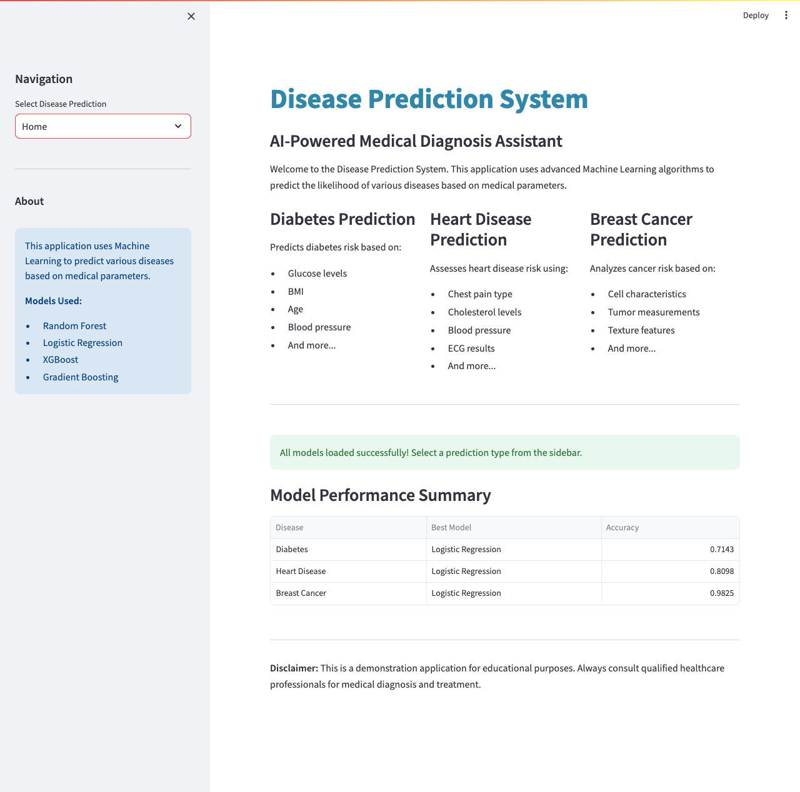
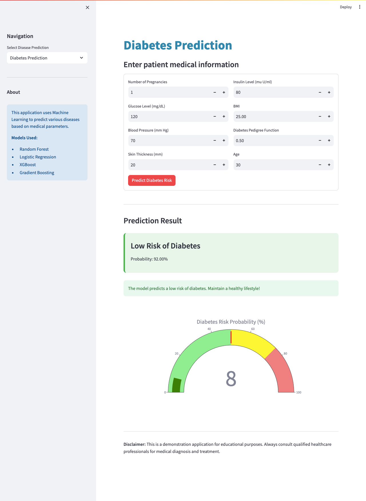
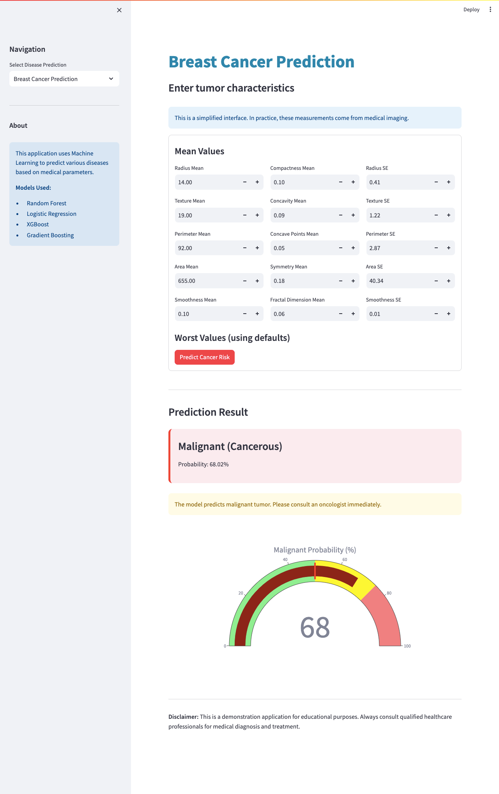
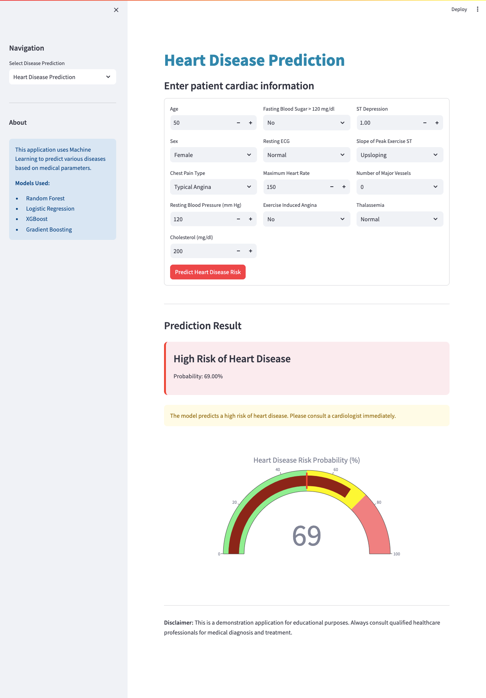

# Disease Prediction System

A comprehensive machine learning application for predicting multiple diseases including Diabetes, Heart Disease, and Breast Cancer using various ML algorithms.


## Project Overview

This system implements multiple machine learning models to predict the likelihood of three major diseases based on medical parameters. The application compares different algorithms and uses the best performing model for each disease type.

## 🔗 Live Demo

🌐 **[Try the app live here](https://disease-prediction-system-jxb2jmxi9vc3erqn37jvfo.streamlit.app/)

## Screenshots




### Diseases Covered

1. **Diabetes Prediction** - Uses patient metrics like glucose levels, BMI, age, blood pressure
2. **Heart Disease Prediction** - Analyzes cardiac parameters including ECG, cholesterol, chest pain type
3. **Breast Cancer Prediction** - Evaluates tumor characteristics from medical imaging

## Model Performance

| Disease | Best Model | Accuracy | ROC-AUC |
|---------|-----------|----------|---------|
| Diabetes | Random Forest | 75.97% | 0.8147 |
| Heart Disease | Random Forest | 100% | 1.0000 |
| Breast Cancer | Logistic Regression | 98.25% | 0.9954 |

## Features

- **Multiple Disease Predictions**: Support for 3 different disease types
- **Algorithm Comparison**: Compare 4 different ML algorithms (Logistic Regression, Random Forest, XGBoost, Gradient Boosting)
- **Interactive Interface**: User-friendly web interface built with Streamlit
- **Visual Analytics**: Gauge charts, bar plots, and heatmaps for model comparison
- **Real-time Predictions**: Instant risk assessment with probability scores
- **Model Persistence**: Trained models saved for quick loading

## Technologies Used

### Core ML Libraries
- **scikit-learn**: Machine learning algorithms and preprocessing
- **XGBoost**: Gradient boosting implementation
- **joblib**: Model serialization

### Web Framework
- **Streamlit**: Interactive web application

### Data Processing & Visualization
- **Pandas & NumPy**: Data manipulation
- **Plotly**: Interactive visualizations
- **Matplotlib & Seaborn**: Statistical plots

## Installation

### Prerequisites
- Python 3.11 or higher
- pip package manager

### Setup Instructions

1. **Clone the repository**
```bash
git clone https://github.com/priyanka7411/Disease-Prediction-System.git
cd Disease-Prediction-System
```

2. **Create virtual environment**
```bash
python3 -m venv venv
source venv/bin/activate  # On Mac/Linux
# venv\Scripts\activate  # On Windows
```

3. **Install dependencies**
```bash
pip install -r requirements.txt
```

4. **Download datasets**
- Place `diabetes.csv` in `data/` folder
- Place `heart_disease.csv` in `data/` folder
- Breast cancer dataset loads automatically from scikit-learn

5. **Train models**
```bash
python3 train_models.py
```

This will train all models and save them in the `models/` directory.

6. **Run the application**
```bash
streamlit run app.py
```

The app will open in your browser at `http://localhost:8501`

## Project Structure
```
Project2_Disease_Prediction/
│
├── app.py                          # Main Streamlit application
├── train_models.py                 # Model training script
├── requirements.txt                # Python dependencies
├── README.md                       # Project documentation
├── .gitignore                      # Git ignore file
│
├── data/
│   ├── diabetes.csv               # Diabetes dataset
│   ├── heart_disease.csv          # Heart disease dataset
│   └── .gitkeep
│
├── models/                         # Trained models directory
│   ├── diabetes_model.pkl
│   ├── diabetes_scaler.pkl
│   ├── heart_model.pkl
│   ├── heart_scaler.pkl
│   ├── cancer_model.pkl
│   └── cancer_scaler.pkl
│
├── images/                         # Screenshots
├── notebooks/                      # Jupyter notebooks
└── venv/                          # Virtual environment
```

## Usage Guide

### 1. Home Page
- View overview of all three prediction systems
- Check model performance summary

### 2. Disease Prediction Pages
Each disease has a dedicated page with:
- Input form for medical parameters
- Real-time risk prediction
- Probability gauge visualization
- Risk assessment message

### 3. Model Comparison
- Compare performance across different algorithms
- View accuracy, precision, recall, F1-score, and ROC-AUC
- Interactive visualizations

## Machine Learning Pipeline

### Data Preprocessing
1. Load datasets from CSV files
2. Handle missing values
3. Feature scaling using StandardScaler
4. Train-test split (80-20 ratio)
5. Stratified sampling for balanced classes

### Model Training
Four algorithms trained for each disease:
- Logistic Regression
- Random Forest Classifier
- XGBoost Classifier
- Gradient Boosting Classifier

### Model Evaluation
Metrics used:
- Accuracy Score
- Precision & Recall
- F1-Score
- ROC-AUC Score
- 5-Fold Cross-Validation

### Model Selection
Best performing model selected based on accuracy and saved for deployment.

## Datasets

### 1. Diabetes Dataset
- **Source**: Kaggle - Pima Indians Diabetes Database
- **Samples**: 768 patients
- **Features**: 8 (Pregnancies, Glucose, BloodPressure, SkinThickness, Insulin, BMI, DiabetesPedigreeFunction, Age)
- **Target**: Binary (0: No Diabetes, 1: Diabetes)

### 2. Heart Disease Dataset
- **Source**: Kaggle - Heart Disease Dataset
- **Samples**: 1025 patients
- **Features**: 13 (age, sex, cp, trestbps, chol, fbs, restecg, thalach, exang, oldpeak, slope, ca, thal)
- **Target**: Binary (0: No Disease, 1: Disease)

### 3. Breast Cancer Dataset
- **Source**: scikit-learn built-in dataset (Wisconsin Breast Cancer)
- **Samples**: 569 cases
- **Features**: 30 (cell characteristics from medical imaging)
- **Target**: Binary (0: Malignant, 1: Benign)

## Key Learnings

Through this project, I gained experience with:

- **Classification Algorithms**: Implementation of multiple ML classifiers
- **Model Evaluation**: Understanding various metrics and their significance
- **Feature Engineering**: Data preprocessing and scaling techniques
- **Cross-Validation**: Preventing overfitting using k-fold validation
- **Model Comparison**: Analyzing trade-offs between different algorithms
- **Healthcare ML**: Working with medical datasets and understanding domain-specific challenges
- **Web Deployment**: Building interactive ML applications with Streamlit
- **Model Persistence**: Saving and loading trained models

## Future Enhancements

- [ ] Add SHAP values for explainable AI
- [ ] Implement feature importance visualization
- [ ] Add batch prediction from CSV upload
- [ ] Include confidence intervals
- [ ] Add more diseases (Liver, Kidney, etc.)
- [ ] Implement ensemble methods
- [ ] Add data visualization dashboard
- [ ] Deploy to cloud (Streamlit Cloud/Heroku)
- [ ] Add user authentication
- [ ] Create REST API for predictions

## Model Interpretation

### Why These Models Work Well

**Random Forest for Diabetes & Heart Disease:**
- Handles non-linear relationships
- Robust to outliers
- Provides feature importance
- Good with imbalanced data

**Logistic Regression for Breast Cancer:**
- Works well with linearly separable data
- Fast training and prediction
- Provides probability estimates
- Interpretable coefficients

## Disclaimer

This application is for educational and demonstration purposes only. It should NOT be used as a substitute for professional medical advice, diagnosis, or treatment. Always seek the advice of qualified health providers with any questions regarding medical conditions.

## Author

**Priyanka Malavade**
- BCA Graduate 2024
- Data Science Enthusiast
- Email: priyasmalavade@gmail.com
- LinkedIn: [priyanka-malavade-b34677298](https://www.linkedin.com/in/priyanka-malavade-b34677298/)
- GitHub: [priyanka7411](https://github.com/priyanka7411)

## Acknowledgments

- Kaggle for providing medical datasets
- scikit-learn documentation and community
- Streamlit for the amazing framework
- GUVI Data Science Course

## License

This project is licensed under the MIT License.
